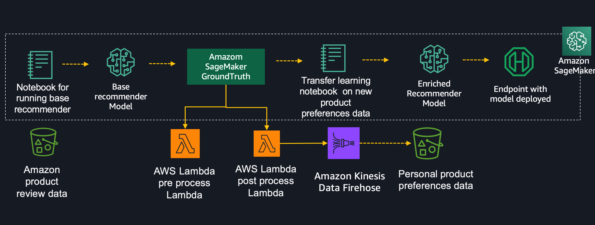
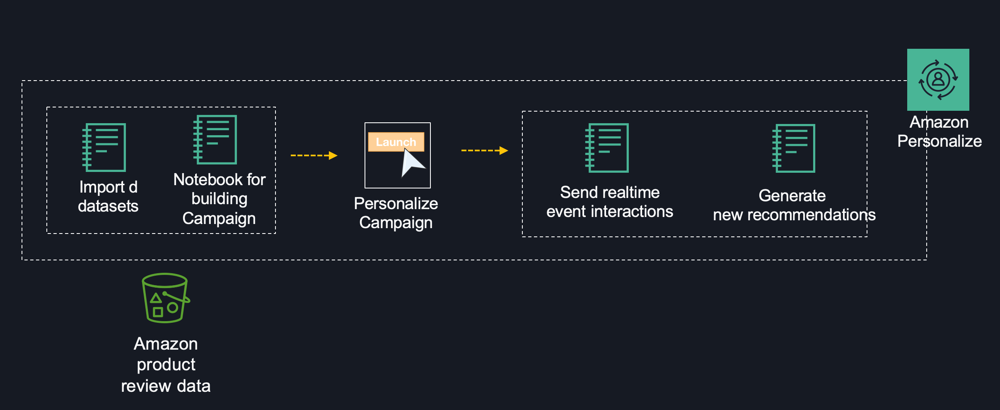

# Building recommender system with Amazon ML services

## Getting Started

The below steps will walk you through building an environment. If you have any issues with any of the content below please open an issue here in the repository.

## Prerequisites

You will need access to AWS account in order to run the AWS cloudformation script.
This will be provided to you using the Event engine login. 
Please check with the speakers in order to get access to a AWS account.

## AWS account access - Event engine login url

<a href="https://dashboard.eventengine.run/login" target="_blank">Event engine URL</a>

Use the Team hash to login. The team hash will be provided by the speakers.

## Setup Environment

Make sure you have logged into the AWS account (using Event engine login) before starting this. Once logged in, you can click on the link below to deply the AWS Cloudformation script. 

Follow along with the screenshots if you have any questions about these steps.

### Cloud Formation Wizard

Start by clicking `Next` at the bottom like shown:

Click `Next` again (all required values should be pre polulated)

This page is a bit longer so scroll to the bottom to click `Next`.

Again scroll to the bottom, check the box to enable the template to create new IAM resources and then click `Create Stack`.

Once it has completed you'll see green text like below indicating that the work has been completed:

## Overall architecture

The steps below outline the process of building your own recommendation model, improving it, and then cleaning up all of your resources to prevent any unwanted charges. To get started executing these follow the steps in the next section.

### Activity 1

Steps:
 - Use a pre-trained model to generate recommendations (it will have steps to show how the model was built)
 - Amazon Sagemaker Ground Truth to generate test data
 - Using this generated data to do transfer learning on the previous model

### Activity 2

Steps:
 - Use Amazon Personalize to generate recommendations
 - Enable event tracking and view updated recommendations

## Using the Notebooks

The rest of the lab will take place via the Jupyter notebooks, simply read each block before executing it and moving onto the next. If you have any questions about how to use the notebooks please ask your instructor or if you are working independently this is a pretty good video to get started:

<a href="https://www.youtube.com/watch?v=Gzun8PpyBCo" target="_blank">Using JupyterLab</a>

We have 6 notebooks:

 - 1_recommender.ipynb - Base recommender
 - 2_ground_truth_setup.ipynb - Setup Amazon Ground Truth to generate more personalized training data
 - 3_transfer_learning.ipynb - Run transfer learning
 - 4_personalize_build_campaign.ipynb - Run personalization
 - 5_view_campaign_and_interactions.ipynb - Enable event tracking
 - 6_cleanup.ipynb - Cleanup

## After the Notebooks

You'll now notice that the stack is in progress of being deleted. Once you see `Delete Completed` you know that everything has been deleted and you are 100% done with this lab.
