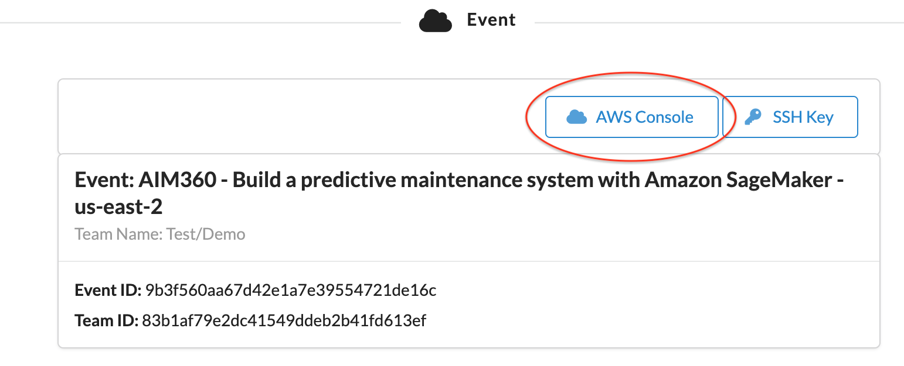
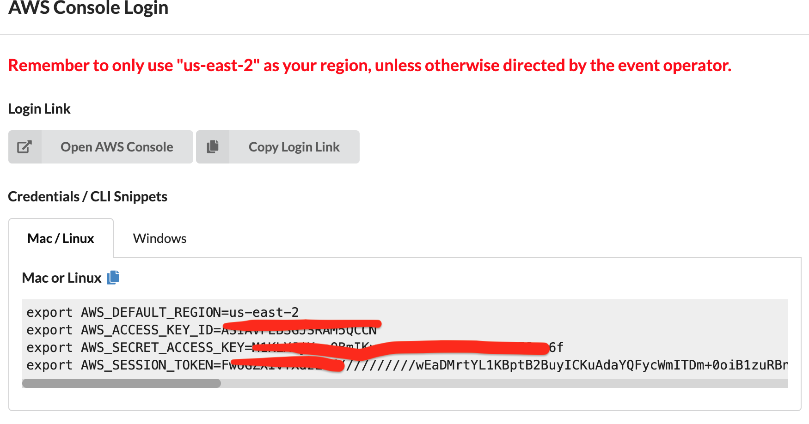
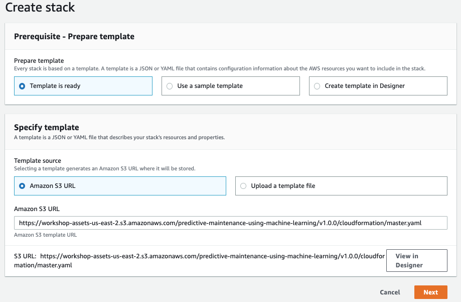
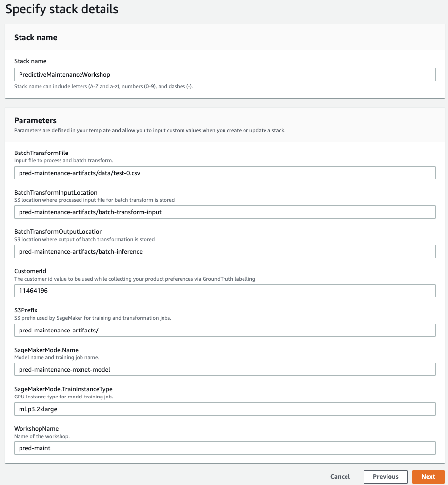
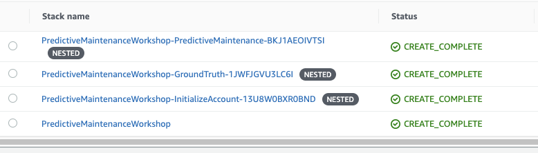

# Build a predictive maintenance system with Amazon SageMaker

## Getting Started

The below steps will walk you through building an environment. 

## Prerequisites

You will need access to AWS account in order to run the AWS cloudformation script.
The next few steps will will provide Event engine login. 
Please check with the speakers if you have trouble.

## AWS account access - Event engine login url

<a href="https://dashboard.eventengine.run/login" target="_blank">Event engine URL</a>

Use the Team hash to login. The team hash will be provided by the speakers.

## Setup Environment

Make sure you have logged into the AWS account (using Event engine login) before starting this. Once logged in, you can click on the link below to deply the AWS Cloudformation script. 

### us-east-2 (Ohio)

/*:
### eu-central-1 (Frankfurt)

 */

Follow along with the screenshots if you have any questions about these steps.

### Cloud Formation Wizard

Start by clicking `Next` at the bottom like shown:

Click `Next` again (all required values should be pre polulated)

This page is a bit longer so scroll to the bottom to click `Next`.

Again scroll to the bottom, check the box to enable the template to create new IAM resources and then click `Create Stack`.

Once it has completed you'll see green text like below indicating that the work has been completed:

## Overall architecture

The steps below outline the process of building your own predictive maintenance model, enhancing it with root cause analysis, and then cleaning up all of your resources. To get started executing these follow the steps in the next section.

### Activity 1

Place architecture diagram

### Activity 2

Place architecture diagram

## Using the Notebooks

The rest of the lab will take place via the Jupyter notebooks, simply read each block before executing it and moving onto the next. If you have any questions about how to use the notebooks please ask your instructor or if you are working independently this is a pretty good video to get started:

<a href="https://www.youtube.com/watch?v=Gzun8PpyBCo" target="_blank">Using JupyterLab</a>

We have 2 notebooks:

 - sagemaker_predictive_maintenance.ipynb - notebook to build the initial LSTM model
 - ground_truth_setup.ipynb - Setup Amazon Ground Truth to generate data for Root cause analysis

